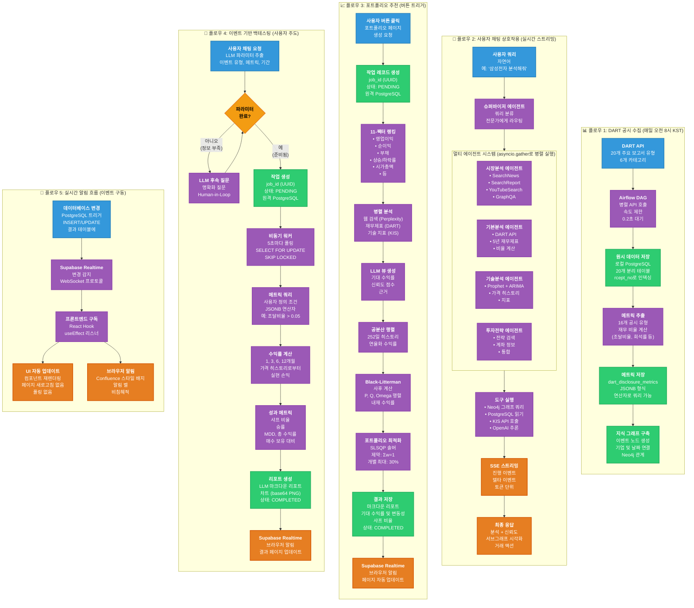

# Stockelper 데이터 플로우 다이어그램

Stockelper 시스템의 5가지 핵심 데이터 흐름을 보여주는 다이어그램입니다. 데이터가 진입점에서 처리 단계를 거쳐 최종 결과물까지 어떻게 이동하는지 설명합니다.

## 개요

Stockelper 플랫폼은 5가지 주요 흐름을 통해 데이터를 처리합니다:

1. **DART 수집 파이프라인** (매일, 오전 8시) - 자동화된 공시 데이터 수집
2. **사용자 채팅 상호작용** (실시간) - 멀티 에이전트 AI 분석
3. **포트폴리오 추천** (사용자 트리거) - Black-Litterman 최적화
4. **이벤트 기반 백테스팅** (사용자 주도) - 과거 성과 분석
5. **실시간 알림** (이벤트 구동) - 사용자에게 푸시 업데이트

## 범례

- **🔵 파란색 노드**: 데이터 소스 및 진입점
- **🟣 보라색 노드**: 처리 단계 및 변환
- **🟢 초록색 노드**: 저장 작업
- **🟠 주황색 노드**: 출력 및 결과
- **🟡 노란색 노드**: 의사결정 지점

## 데이터 플로우 다이어그램

## 플로우 세부사항

### 플로우 1: DART 수집 파이프라인
**트리거**: 매일 오전 8시 KST (Airflow 스케줄러)

**목적**: 한국 금융 공시를 수집하고 정량적 메트릭 추출

**처리 시간**: 100개 이상 종목에 대해 약 30-60분

**핵심 기술**:
- Apache Airflow 2.10 오케스트레이션
- OpenDART API 데이터 소스
- PostgreSQL 구조화된 저장소
- Neo4j 지식 그래프

**출력**:
- PostgreSQL의 원시 공시 (20개 테이블)
- JSONB 형식의 계산된 메트릭 (16개 유형)
- 지식 그래프 노드 및 관계

---

### 플로우 2: 사용자 채팅 상호작용
**트리거**: 사용자가 채팅 인터페이스에 메시지 입력

**목적**: 멀티 에이전트 시스템을 사용한 실시간 AI 분석 제공

**처리 시간**: 2-5초 (LLM 추론 포함)

**핵심 기술**:
- LangGraph 멀티 에이전트 오케스트레이션
- GPT-5.1 자연어 이해
- Neo4j 그래프 패턴 매칭
- Server-Sent Events 스트리밍

**출력**:
- 스트리밍 분석 응답
- 서브그래프 시각화
- 신뢰도 점수
- 거래 액션 제안

---

### 플로우 3: 포트폴리오 추천
**트리거**: 사용자가 "추천 생성" 버튼 클릭

**목적**: Black-Litterman 모델을 사용한 최적화된 포트폴리오 생성

**처리 시간**: 3-5분 (비동기 작업)

**핵심 기술**:
- 11-팩터 랭킹 알고리즘
- Black-Litterman 최적화
- SLSQP 솔버 (scipy.optimize)
- Perplexity AI 시장 컨텍스트

**출력**:
- 상위 10개 종목 추천
- 기대 수익률 및 변동성
- 기준 대비 샤프 비율
- 차트가 포함된 마크다운 리포트

---

### 플로우 4: 이벤트 기반 백테스팅
**트리거**: 사용자가 채팅 인터페이스를 통해 요청

**목적**: 과거 이벤트 데이터를 사용한 투자 전략 검증

**처리 시간**: 백테스트당 5-10분 (비동기 작업)

**핵심 기술**:
- 워커 폴링 방식 PostgreSQL 작업 큐
- 유연한 쿼리를 위한 JSONB 연산자
- 과거 가격 데이터 분석
- LLM 생성 리포트

**출력**:
- 다중 타임프레임 수익률 (1/3/6/12개월)
- 샤프 비율 비교
- 승률 통계
- 상세 마크다운 리포트

---

### 플로우 5: 실시간 알림
**트리거**: 데이터베이스 변경 (INSERT/UPDATE)

**목적**: 클라이언트 측 폴링 없이 즉각적인 업데이트 제공

**처리 시간**: <100ms 지연시간

**핵심 기술**:
- Supabase Realtime (WebSocket 기반)
- PostgreSQL 트리거
- React 구독 훅

**출력**:
- 자동 UI 업데이트
- 브라우저 알림 배지
- 비침해적 알림

## 데이터 변환 요약

| 플로우 | 입력 형식 | 변환 | 출력 형식 |
|------|-------------|----------------|---------------|
| DART 수집 | XML/JSON | 텍스트 추출, 메트릭 계산 | PostgreSQL 테이블, Neo4j 그래프 |
| 채팅 상호작용 | 자연어 | 멀티 에이전트 분석, 종합 | 스트리밍 텍스트, JSON 서브그래프 |
| 포트폴리오 | 버튼 클릭 | 랭킹, 최적화 | 마크다운 리포트, PNG 차트 |
| 백테스팅 | 채팅 파라미터 | 이벤트 매칭, 수익률 계산 | 성과 메트릭, 리포트 |
| 알림 | DB 트리거 | 변경 감지 | WebSocket 메시지, UI 업데이트 |

## 처리 특성

| 플로우 | 유형 | 동시성 | 규모 |
|------|------|-------------|-------|
| DART 수집 | 배치 | 속도 제한을 둔 순차 | 무제한 과거 데이터 |
| 채팅 상호작용 | 실시간 | 병렬 에이전트 실행 | 100명 이상 동시 사용자 |
| 포트폴리오 | 비동기 작업 | 큐 기반 워커 | 다중 대기 요청 |
| 백테스팅 | 비동기 작업 | 큐 기반 워커 | 다중 대기 요청 |
| 알림 | 이벤트 구동 | 모든 구독자에게 푸시 | 실시간 브로드캐스트 |

## 관련 문서

- [시스템 아키텍처](./system-architecture-ko.md) - 서비스 토폴로지 및 연결
- [아키텍처 결정 문서](../architecture.md) - 상세 설계 결정사항
- [PRD](../prd.md) - 각 플로우의 기능 요구사항
- [개별 서비스 README](../../sources/*/README.md) - 서비스별 세부사항

## 이 다이어그램 보는 방법

- **GitHub**: 마크다운 프리뷰에서 자동 렌더링
- **VS Code**: Mermaid 확장 프로그램 설치하여 라이브 프리뷰
- **Mermaid Live Editor**: 코드를 [mermaid.live](https://mermaid.live/)에 복사
- **내보내기**: Mermaid CLI를 사용하여 프레젠테이션용 PNG/SVG 생성
