# Stockelper Data Flow Diagram

This diagram illustrates the 5 key data flows in the Stockelper system, showing how data moves from entry points through processing steps to final outputs.

## Overview

The Stockelper platform processes data through five primary flows:

1. **DART Collection Pipeline** (Daily, 8:00 AM) - Automated disclosure data collection
2. **User Chat Interaction** (Real-time) - Multi-agent AI analysis
3. **Portfolio Recommendation** (User-triggered) - Black-Litterman optimization
4. **Event-Based Backtesting** (User-initiated) - Historical performance analysis
5. **Real-Time Notifications** (Event-driven) - Push updates to users

## Legend

- **🔵 Blue nodes**: Data sources and entry points
- **🟣 Purple nodes**: Processing steps and transformations
- **🟢 Green nodes**: Storage operations
- **🟠 Orange nodes**: Outputs and results
- **🟡 Yellow nodes**: Decision points

## Data Flow Diagram

```mermaid
graph TB
    %% ========== STYLING ==========
    classDef dataSource fill:#3498DB,stroke:#2980B9,stroke-width:2px,color:#fff
    classDef process fill:#9B59B6,stroke:#8E44AD,stroke-width:2px,color:#fff
    classDef storage fill:#2ECC71,stroke:#27AE60,stroke-width:2px,color:#fff
    classDef output fill:#E67E22,stroke:#D35400,stroke-width:2px,color:#fff
    classDef decision fill:#F39C12,stroke:#E67E22,stroke-width:2px,color:#000

    %% ========== FLOW 1: DART COLLECTION PIPELINE ==========
    subgraph FLOW1["📊 Flow 1: DART Disclosure Collection (Daily 8:00 AM KST)"]
        direction TB
        D1_START["<b>DART API</b><br/>20 Major Report Types<br/>6 Categories"]:::dataSource
        D1_COLLECT["<b>Airflow DAG</b><br/>Parallel API Calls<br/>Rate Limited<br/>0.2s Sleep"]:::process
        D1_STORE1["<b>Store Raw Data</b><br/>Local PostgreSQL<br/>20 Separate Tables<br/>Indexed by rcept_no"]:::storage
        D1_EXTRACT["<b>Metrics Extraction</b><br/>16 Disclosure Types<br/>Calculate Financial Ratios<br/>(조달비율, 희석률, etc.)"]:::process
        D1_STORE2["<b>Store Metrics</b><br/>dart_disclosure_metrics<br/>JSONB Format<br/>Queryable via operators"]:::storage
        D1_KG["<b>Build Knowledge Graph</b><br/>Create Event Nodes<br/>Link Companies & Dates<br/>Neo4j Relationships"]:::storage

        D1_START --> D1_COLLECT
        D1_COLLECT --> D1_STORE1
        D1_STORE1 --> D1_EXTRACT
        D1_EXTRACT --> D1_STORE2
        D1_STORE2 --> D1_KG
    end

    %% ========== FLOW 2: USER CHAT INTERACTION ==========
    subgraph FLOW2["💬 Flow 2: User Chat Interaction (Real-time Streaming)"]
        direction TB
        C1_USER["<b>User Query</b><br/>Natural Language<br/>e.g., '삼성전자 분석해줘'"]:::dataSource
        C1_ROUTER["<b>SupervisorAgent</b><br/>Query Classification<br/>Route to Specialists"]:::process

        subgraph AGENTS["Multi-Agent System (Parallel Execution via asyncio.gather)"]
            direction LR
            C1_MARKET["<b>MarketAnalysisAgent</b><br/>• SearchNews<br/>• SearchReport<br/>• YouTubeSearch<br/>• GraphQA"]:::process
            C1_FUND["<b>FundamentalAgent</b><br/>• DART API<br/>• 5-Year Financials<br/>• Ratio Calculation"]:::process
            C1_TECH["<b>TechnicalAgent</b><br/>• Prophet + ARIMA<br/>• Price History<br/>• Indicators"]:::process
            C1_INV["<b>InvestmentAgent</b><br/>• Strategy Search<br/>• Account Info<br/>• Integration"]:::process
        end

        C1_TOOLS["<b>Tool Execution</b><br/>• Neo4j Graph Queries<br/>• PostgreSQL Reads<br/>• KIS API Calls<br/>• OpenAI Inference"]:::process
        C1_STREAM["<b>SSE Streaming</b><br/>Progress Events<br/>Delta Events<br/>Token-by-Token"]:::output
        C1_FINAL["<b>Final Response</b><br/>Analysis + Confidence<br/>Subgraph Visualization<br/>Trading Actions"]:::output

        C1_USER --> C1_ROUTER
        C1_ROUTER --> AGENTS
        AGENTS --> C1_TOOLS
        C1_TOOLS --> C1_STREAM
        C1_STREAM --> C1_FINAL
    end

    %% ========== FLOW 3: PORTFOLIO RECOMMENDATION ==========
    subgraph FLOW3["📈 Flow 3: Portfolio Recommendation (Button-Triggered)"]
        direction TB
        P1_TRIGGER["<b>User Button Click</b><br/>Portfolio Page<br/>Request Generation"]:::dataSource
        P1_JOB["<b>Create Job Record</b><br/>job_id (UUID)<br/>status: PENDING<br/>Remote PostgreSQL"]:::storage
        P1_RANK["<b>11-Factor Ranking</b><br/>• Operating Profit<br/>• Net Income<br/>• Liabilities<br/>• Rise/Fall Rates<br/>• Market Cap<br/>• etc."]:::process
        P1_PARALLEL["<b>Parallel Analysis</b><br/>WebSearch (Perplexity)<br/>Financial Statements (DART)<br/>Technical Indicators (KIS)"]:::process
        P1_VIEW["<b>LLM ViewGenerator</b><br/>Expected Returns<br/>Confidence Scores<br/>Reasoning"]:::process
        P1_COV["<b>Covariance Matrix</b><br/>252-Day History<br/>Annualized Returns"]:::process
        P1_BL["<b>Black-Litterman</b><br/>Posterior Calculation<br/>P, Q, Omega Matrices<br/>Implied Returns"]:::process
        P1_OPT["<b>Portfolio Optimization</b><br/>SLSQP Solver<br/>Constraints: Σw=1<br/>Individual max: 30%"]:::process
        P1_RESULT["<b>Store Results</b><br/>Markdown Report<br/>Expected Return & Vol<br/>Sharpe Ratio<br/>status: COMPLETED"]:::storage
        P1_NOTIFY["<b>Supabase Realtime</b><br/>Browser Notification<br/>Auto Page Update"]:::output

        P1_TRIGGER --> P1_JOB
        P1_JOB --> P1_RANK
        P1_RANK --> P1_PARALLEL
        P1_PARALLEL --> P1_VIEW
        P1_VIEW --> P1_COV
        P1_COV --> P1_BL
        P1_BL --> P1_OPT
        P1_OPT --> P1_RESULT
        P1_RESULT --> P1_NOTIFY
    end

    %% ========== FLOW 4: BACKTESTING ==========
    subgraph FLOW4["🔬 Flow 4: Event-Based Backtesting (User-Initiated)"]
        direction TB
        B1_CHAT["<b>User Chat Request</b><br/>LLM Extracts Parameters<br/>Event Type, Metrics, Period"]:::dataSource
        B1_VALIDATE{"<b>Parameters<br/>Complete?</b>"}:::decision
        B1_PROMPT["<b>LLM Follow-Up</b><br/>Ask Clarifying Questions<br/>Human-in-Loop"]:::process
        B1_CREATE["<b>Create Job</b><br/>job_id (UUID)<br/>status: PENDING<br/>Remote PostgreSQL"]:::storage
        B1_WORKER["<b>Async Worker</b><br/>Poll Every 5 Seconds<br/>SELECT FOR UPDATE<br/>SKIP LOCKED"]:::process
        B1_QUERY["<b>Query Metrics</b><br/>User-Defined Conditions<br/>JSONB Operators<br/>e.g., 조달비율 > 0.05"]:::process
        B1_RETURNS["<b>Calculate Returns</b><br/>1, 3, 6, 12 Months<br/>From Price History<br/>Realized P&L"]:::process
        B1_SHARPE["<b>Performance Metrics</b><br/>Sharpe Ratio<br/>Win Rate<br/>MDD, Total Return<br/>vs Buy-and-Hold"]:::process
        B1_REPORT["<b>Generate Report</b><br/>LLM Markdown Report<br/>Charts (base64 PNG)<br/>status: COMPLETED"]:::storage
        B1_NOTIFY2["<b>Supabase Realtime</b><br/>Browser Notification<br/>Results Page Update"]:::output

        B1_CHAT --> B1_VALIDATE
        B1_VALIDATE -->|"No<br/>(Missing Info)"| B1_PROMPT
        B1_PROMPT --> B1_VALIDATE
        B1_VALIDATE -->|"Yes<br/>(Ready)"| B1_CREATE
        B1_CREATE --> B1_WORKER
        B1_WORKER --> B1_QUERY
        B1_QUERY --> B1_RETURNS
        B1_RETURNS --> B1_SHARPE
        B1_SHARPE --> B1_REPORT
        B1_REPORT --> B1_NOTIFY2
    end

    %% ========== FLOW 5: REAL-TIME NOTIFICATIONS ==========
    subgraph FLOW5["🔔 Flow 5: Real-Time Notification Flow (Event-Driven)"]
        direction TB
        N1_CHANGE["<b>Database Change</b><br/>PostgreSQL Trigger<br/>INSERT/UPDATE<br/>on Results Tables"]:::dataSource
        N1_SUPABASE["<b>Supabase Realtime</b><br/>Change Detection<br/>WebSocket Protocol"]:::process
        N1_SUBSCRIBE["<b>Frontend Subscription</b><br/>React Hook<br/>useEffect Listener"]:::process
        N1_UPDATE["<b>UI Auto-Update</b><br/>Re-render Components<br/>No Page Refresh<br/>No Polling"]:::output
        N1_BROWSER["<b>Browser Notification</b><br/>Confluence-Style Badge<br/>Notification Bell<br/>Non-Intrusive"]:::output

        N1_CHANGE --> N1_SUPABASE
        N1_SUPABASE --> N1_SUBSCRIBE
        N1_SUBSCRIBE --> N1_UPDATE
        N1_SUBSCRIBE --> N1_BROWSER
    end
```

## Flow Details

### Flow 1: DART Collection Pipeline
**Trigger**: Daily at 8:00 AM KST (Airflow scheduler)

**Purpose**: Collect Korean financial disclosures and extract quantitative metrics

**Processing Time**: ~30-60 minutes for 100+ stocks

**Key Technologies**:
- Apache Airflow 2.10 for orchestration
- OpenDART API for data source
- PostgreSQL for structured storage
- Neo4j for knowledge graph

**Output**:
- Raw disclosures in PostgreSQL (20 tables)
- Calculated metrics in JSONB format (16 types)
- Knowledge graph nodes and relationships

---

### Flow 2: User Chat Interaction
**Trigger**: User types message in chat interface

**Purpose**: Provide real-time AI analysis using multi-agent system

**Processing Time**: 2-5 seconds (including LLM inference)

**Key Technologies**:
- LangGraph for multi-agent orchestration
- GPT-5.1 for natural language understanding
- Neo4j for graph pattern matching
- Server-Sent Events for streaming

**Output**:
- Streaming analysis response
- Subgraph visualization
- Confidence scores
- Trading action suggestions

---

### Flow 3: Portfolio Recommendation
**Trigger**: User clicks "Generate Recommendation" button

**Purpose**: Create optimized portfolio using Black-Litterman model

**Processing Time**: 3-5 minutes (async job)

**Key Technologies**:
- 11-factor ranking algorithm
- Black-Litterman optimization
- SLSQP solver (scipy.optimize)
- Perplexity AI for market context

**Output**:
- Top 10 stock recommendations
- Expected return & volatility
- Sharpe ratio vs baseline
- Markdown report with charts

---

### Flow 4: Event-Based Backtesting
**Trigger**: User requests via chat interface

**Purpose**: Validate investment strategies using historical event data

**Processing Time**: 5-10 minutes per backtest (async job)

**Key Technologies**:
- PostgreSQL job queue with worker polling
- JSONB operators for flexible queries
- Historical price data analysis
- LLM-generated reports

**Output**:
- Multi-timeframe returns (1/3/6/12 months)
- Sharpe ratio comparison
- Win rate statistics
- Detailed Markdown report

---

### Flow 5: Real-Time Notifications
**Trigger**: Database changes (INSERT/UPDATE)

**Purpose**: Provide instant updates without client-side polling

**Processing Time**: <100ms latency

**Key Technologies**:
- Supabase Realtime (WebSocket-based)
- PostgreSQL triggers
- React subscription hooks

**Output**:
- Automatic UI updates
- Browser notification badges
- Non-intrusive alerts

## Data Transformation Summary

| Flow | Input Format | Transformation | Output Format |
|------|-------------|----------------|---------------|
| DART Collection | XML/JSON | Text extraction, metric calculation | PostgreSQL tables, Neo4j graph |
| Chat Interaction | Natural language | Multi-agent analysis, synthesis | Streaming text, JSON subgraph |
| Portfolio | Button click | Ranking, optimization | Markdown report, PNG charts |
| Backtesting | Chat parameters | Event matching, return calculation | Performance metrics, report |
| Notifications | DB trigger | Change detection | WebSocket message, UI update |

## Processing Characteristics

| Flow | Type | Concurrency | Scale |
|------|------|-------------|-------|
| DART Collection | Batch | Sequential with rate limiting | Unlimited historical data |
| Chat Interaction | Real-time | Parallel agent execution | 100+ concurrent users |
| Portfolio | Async job | Queue-based workers | Multiple queued requests |
| Backtesting | Async job | Queue-based workers | Multiple queued requests |
| Notifications | Event-driven | Push to all subscribers | Real-time broadcast |

## Related Documentation

- [System Architecture](./system-architecture.md) - Service topology and connections
- [Architecture Decision Document](../architecture.md) - Detailed design decisions
- [PRD](../prd.md) - Functional requirements for each flow
- [Individual Service READMEs](../../sources/*/README.md) - Service-specific details

## Viewing This Diagram

- **GitHub**: Renders automatically in markdown preview
- **VS Code**: Install Mermaid extension for live preview
- **Mermaid Live Editor**: Copy code to [mermaid.live](https://mermaid.live/)
- **Export**: Use Mermaid CLI to generate PNG/SVG for presentations
