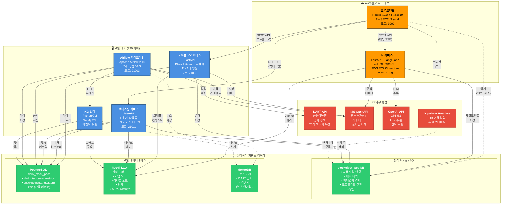

# Stockelper 시스템 아키텍처

Stockelper AI 기반 투자 플랫폼의 전체 아키텍처를 보여주는 다이어그램입니다. 모든 마이크로서비스, 데이터베이스, 외부 통합을 포함합니다.

## 아키텍처 개요

시스템은 AWS 클라우드와 로컬 인프라에 배포된 **7개의 마이크로서비스**로 구성되어 있으며, **3개의 데이터베이스 시스템**(PostgreSQL, MongoDB, Neo4j)을 활용하고 여러 외부 API와 통합됩니다.

## 범례

- **🟧 주황색 노드**: AWS 클라우드 서비스 (프론트엔드, LLM 서비스)
- **🟦 파란색 노드**: 로컬 서비스 (포트폴리오, 백테스팅, Airflow, KG 빌더)
- **🟩 초록색 노드**: 데이터베이스 시스템
- **🟥 빨간색 노드**: 외부 API 통합
- **실선 화살표**: 동기식 REST API 호출
- **점선 화살표**: 구독/읽기 전용 패턴

## 시스템 아키텍처 다이어그램

## 서비스 포트 요약

| 서비스 | 포트 | 배포 위치 | 접근 권한 |
|---------|------|------------|--------|
| 프론트엔드 | 3000 | AWS EC2 (t3.small) | Public |
| LLM 서비스 | 21009 | AWS EC2 (t3.medium) | Internal API |
| 포트폴리오 서비스 | 21008 | 로컬 (230 서버) | Internal API |
| 백테스팅 서비스 | 21011 | 로컬 (230 서버) | Internal API |
| Airflow UI | 21003 | 로컬 (230 서버) | Admin 접근 |
| Neo4j Browser | 7474 | 로컬 | Admin 접근 |
| Neo4j Bolt | 7687 | 로컬 | 서비스 접근 |
| PostgreSQL | 5432 | 원격 + 로컬 | 서비스 접근 |
| MongoDB | 27017 | 로컬 | 서비스 접근 |

## 기술 스택

### 프론트엔드 레이어
- **Next.js 15.3** + React 19 + TypeScript 5.8
- **Prisma ORM** 데이터베이스 접근
- **JWT 인증** HttpOnly 쿠키 사용
- **Tailwind CSS** + Radix UI 컴포넌트

### API 레이어
- **FastAPI 0.111** 모든 백엔드 서비스
- **LangGraph** 멀티 에이전트 오케스트레이션
- **Apache Airflow 2.10** 데이터 파이프라인
- **Python 3.12+** 모든 서비스

### 데이터 레이어
- **PostgreSQL 16** (관계형 데이터)
- **Neo4j 5.11+** with APOC (그래프 데이터베이스)
- **MongoDB 7** (문서 저장소)

### 외부 통합
- **OpenDART API** 금융 공시 정보
- **KIS OpenAPI** 거래 및 시장 데이터
- **OpenAI GPT-5.1** LLM 기능
- **Supabase Realtime** 푸시 알림

## 통신 패턴

### 동기식 (REST API)
- 프론트엔드 → LLM 서비스 (스트리밍용 Server-Sent Events)
- 프론트엔드 → 포트폴리오 서비스 (작업 생성)
- 프론트엔드 → 백테스팅 서비스 (작업 생성)
- 서비스 → 외부 API (HTTP 요청)

### 비동기식 (작업 큐)
- 포트폴리오 서비스: PostgreSQL 기반 작업 큐
- 백테스팅 서비스: 워커 폴링 방식 PostgreSQL 작업 큐

### 실시간 (구독)
- 프론트엔드 ← Supabase Realtime (데이터베이스 변경 알림)
- 완료된 작업에 대한 폴링 불필요

### 배치 (스케줄)
- Airflow DAG가 정의된 일정에 따라 실행 (일일, 3시간마다)
- 데이터 수집 후 지식 그래프 업데이트 트리거

## 데이터 플로우 패턴

1. **사용자 주도**: 채팅 쿼리, 포트폴리오 요청, 백테스팅
2. **스케줄**: 데이터 수집을 위한 Airflow DAG
3. **이벤트 구동**: Supabase를 통한 실시간 알림
4. **배치 처리**: 지식 그래프 구축

## 관련 문서

- [데이터 플로우 다이어그램](./data-flow-ko.md) - 각 작업의 상세 흐름
- [아키텍처 결정 문서](../architecture.md) - 완전한 아키텍처 결정사항
- [PRD](../prd.md) - 기능 요구사항
- [설정 가이드](../../README.md) - 배포 지침

## 이 다이어그램 보는 방법

- **GitHub**: 마크다운 프리뷰에서 자동 렌더링
- **VS Code**: Mermaid 확장 프로그램 설치
- **Mermaid Live Editor**: 코드를 [mermaid.live](https://mermaid.live/)에 복사
- **로컬**: Mermaid 지원하는 마크다운 뷰어 사용
