# Stockelper System Architecture

This diagram illustrates the complete architecture of the Stockelper AI-powered investment platform, showing all microservices, databases, and external integrations.

## Architecture Overview

The system consists of **7 microservices** deployed across AWS Cloud and local infrastructure, utilizing **3 database systems** (PostgreSQL, MongoDB, Neo4j) and integrating with multiple external APIs.

## Legend

- **🟧 Orange nodes**: AWS Cloud services (Frontend, LLM Service)
- **🟦 Blue nodes**: Local services (Portfolio, Backtesting, Airflow, KG Builder)
- **🟩 Green nodes**: Database systems
- **🟥 Red nodes**: External API integrations
- **Solid arrows**: Synchronous REST API calls
- **Dashed arrows**: Subscription/read-only patterns

## System Architecture Diagram

```mermaid
graph TB
    %% ========== STYLING ==========
    classDef awsService fill:#FF9900,stroke:#232F3E,stroke-width:2px,color:#000
    classDef localService fill:#4A90E2,stroke:#2E5C8A,stroke-width:2px,color:#fff
    classDef database fill:#2ECC71,stroke:#27AE60,stroke-width:2px,color:#fff
    classDef external fill:#E74C3C,stroke:#C0392B,stroke-width:2px,color:#fff

    %% ========== AWS CLOUD LAYER ==========
    subgraph AWS["☁️ AWS Cloud Deployment"]
        direction TB
        FE["<b>Frontend</b><br/>Next.js 15.3 + React 19<br/>AWS EC2 t3.small<br/>Port: 3000"]:::awsService
        LLM["<b>LLM Service</b><br/>FastAPI + LangGraph<br/>4 Specialized Agents<br/>AWS EC2 t3.medium<br/>Port: 21009"]:::awsService
    end

    %% ========== LOCAL SERVICES LAYER ==========
    subgraph LOCAL["🖥️ Local Deployment (230 Server)"]
        direction TB
        PORT["<b>Portfolio Service</b><br/>FastAPI<br/>Black-Litterman Optimization<br/>11-Factor Ranking<br/>Port: 21008"]:::localService
        BACK["<b>Backtesting Service</b><br/>FastAPI<br/>Async Job Queue<br/>Event-Based Testing<br/>Port: 21011"]:::localService
        AIRFLOW["<b>Airflow Pipeline</b><br/>Apache Airflow 2.10<br/>7 Independent DAGs<br/>Port: 21003"]:::localService
        KG["<b>KG Builder</b><br/>Python CLI<br/>Neo4j ETL<br/>Event Extraction"]:::localService
    end

    %% ========== DATA STORAGE LAYER ==========
    subgraph DATABASES["💾 Data Storage Layer"]
        direction LR
        subgraph REMOTE_DB["Remote PostgreSQL"]
            direction TB
            PG_REMOTE["<b>stockelper_web DB</b><br/>• Users & Auth<br/>• Conversations<br/>• Backtesting Results<br/>• Portfolio Recommendations<br/>• Notifications"]:::database
        end

        subgraph LOCAL_DB["Local Databases"]
            direction TB
            PG_LOCAL["<b>PostgreSQL</b><br/>• daily_stock_price<br/>• dart_disclosure_metrics<br/>• checkpoint (LangGraph)<br/>• ksic (Industry data)"]:::database
            NEO4J["<b>Neo4j 5.11+</b><br/>Knowledge Graph<br/>• Company nodes<br/>• Event nodes<br/>• Relationships<br/>Ports: 7474/7687"]:::database
            MONGO["<b>MongoDB</b><br/>• News Articles<br/>• DART Filings<br/>• Competitors<br/>(News postponed)"]:::database
        end
    end

    %% ========== EXTERNAL APIS ==========
    subgraph EXTERNAL["🌐 External Integrations"]
        direction TB
        DART_API["<b>DART API</b><br/>Korean FSS<br/>Financial Disclosures<br/>20 Report Types"]:::external
        KIS_API["<b>KIS OpenAPI</b><br/>Korea Investment<br/>Trading Data<br/>Real-time Prices"]:::external
        OPENAI["<b>OpenAI API</b><br/>GPT-5.1<br/>LLM Inference<br/>Event Extraction"]:::external
        SUPABASE["<b>Supabase Realtime</b><br/>DB Change Notifications<br/>Push Updates"]:::external
    end

    %% ========== FRONTEND CONNECTIONS ==========
    FE -->|"REST API<br/>(Chat SSE)"| LLM
    FE -->|"REST API<br/>(Portfolio)"| PORT
    FE -->|"REST API<br/>(Backtesting)"| BACK
    FE -->|"Realtime<br/>Subscription"| SUPABASE
    FE -.->|"Read<br/>(Auth, Results)"| PG_REMOTE

    %% ========== LLM SERVICE CONNECTIONS ==========
    LLM -->|"Cypher<br/>Queries"| NEO4J
    LLM -->|"LLM<br/>Inference"| OPENAI
    LLM -->|"Checkpoint<br/>Storage"| PG_REMOTE
    LLM -->|"Stock<br/>Data"| KIS_API

    %% ========== PORTFOLIO SERVICE CONNECTIONS ==========
    PORT -->|"Market<br/>Data"| KIS_API
    PORT -->|"Graph<br/>Context"| NEO4J
    PORT -->|"Write<br/>Results"| PG_REMOTE
    PORT -->|"Price<br/>History"| PG_LOCAL

    %% ========== BACKTESTING SERVICE CONNECTIONS ==========
    BACK -->|"Job Queue<br/>Management"| PG_REMOTE
    BACK -->|"Price<br/>History"| PG_LOCAL
    BACK -->|"Disclosure<br/>Metrics"| PG_LOCAL
    BACK -->|"Event<br/>Patterns"| NEO4J

    %% ========== AIRFLOW CONNECTIONS ==========
    AIRFLOW -->|"Daily<br/>Collection"| DART_API
    AIRFLOW -->|"Price<br/>Updates"| KIS_API
    AIRFLOW -->|"Store<br/>Disclosures"| PG_LOCAL
    AIRFLOW -->|"Store<br/>Prices"| PG_LOCAL
    AIRFLOW -->|"Trigger<br/>ETL"| KG
    AIRFLOW -.->|"Store<br/>News"| MONGO

    %% ========== KG BUILDER CONNECTIONS ==========
    KG -->|"Build<br/>Graph"| NEO4J
    KG -->|"Read<br/>Disclosures"| PG_LOCAL
    KG -.->|"Read<br/>Events"| MONGO

    %% ========== SUPABASE CONNECTIONS ==========
    SUPABASE -.->|"Subscribe to<br/>Changes"| PG_REMOTE
```

## Service Port Summary

| Service | Port | Deployment | Access |
|---------|------|------------|--------|
| Frontend | 3000 | AWS EC2 (t3.small) | Public |
| LLM Service | 21009 | AWS EC2 (t3.medium) | Internal API |
| Portfolio Service | 21008 | Local (230 Server) | Internal API |
| Backtesting Service | 21011 | Local (230 Server) | Internal API |
| Airflow UI | 21003 | Local (230 Server) | Admin access |
| Neo4j Browser | 7474 | Local | Admin access |
| Neo4j Bolt | 7687 | Local | Service access |
| PostgreSQL | 5432 | Remote + Local | Service access |
| MongoDB | 27017 | Local | Service access |

## Technology Stack

### Frontend Layer
- **Next.js 15.3** with React 19 and TypeScript 5.8
- **Prisma ORM** for database access
- **JWT Authentication** with HttpOnly cookies
- **Tailwind CSS** + Radix UI components

### API Layer
- **FastAPI 0.111** for all backend services
- **LangGraph** for multi-agent orchestration
- **Apache Airflow 2.10** for data pipelines
- **Python 3.12+** across all services

### Data Layer
- **PostgreSQL 16** (relational data)
- **Neo4j 5.11+** with APOC (graph database)
- **MongoDB 7** (document storage)

### External Integrations
- **OpenDART API** for financial disclosures
- **KIS OpenAPI** for trading and market data
- **OpenAI GPT-5.1** for LLM capabilities
- **Supabase Realtime** for push notifications

## Communication Patterns

### Synchronous (REST API)
- Frontend → LLM Service (Server-Sent Events for streaming)
- Frontend → Portfolio Service (Job creation)
- Frontend → Backtesting Service (Job creation)
- Services → External APIs (HTTP requests)

### Asynchronous (Job Queue)
- Portfolio Service: PostgreSQL-based job queue
- Backtesting Service: PostgreSQL-based job queue with worker polling

### Real-time (Subscription)
- Frontend ← Supabase Realtime (database change notifications)
- Eliminates need for polling on completed jobs

### Batch (Scheduled)
- Airflow DAGs run on defined schedules (daily, every 3 hours)
- Knowledge graph updates triggered after data collection

## Data Flow Patterns

1. **User-Initiated**: Chat queries, portfolio requests, backtesting
2. **Scheduled**: Airflow DAGs for data collection
3. **Event-Driven**: Real-time notifications via Supabase
4. **Batch Processing**: Knowledge graph construction

## Related Documentation

- [Data Flow Diagram](./data-flow.md) - Detailed flows for each operation
- [Architecture Decision Document](../architecture.md) - Complete architectural decisions
- [PRD](../prd.md) - Functional requirements
- [Setup Guide](../../README.md) - Deployment instructions

## Viewing This Diagram

- **GitHub**: Renders automatically in markdown preview
- **VS Code**: Install Mermaid extension
- **Mermaid Live Editor**: Copy code to [mermaid.live](https://mermaid.live/)
- **Local**: Use any markdown viewer with Mermaid support
